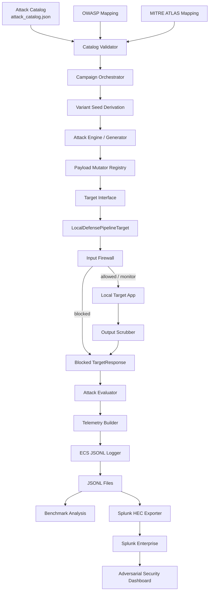
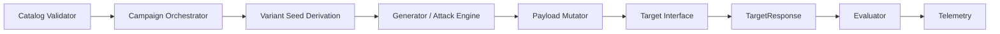
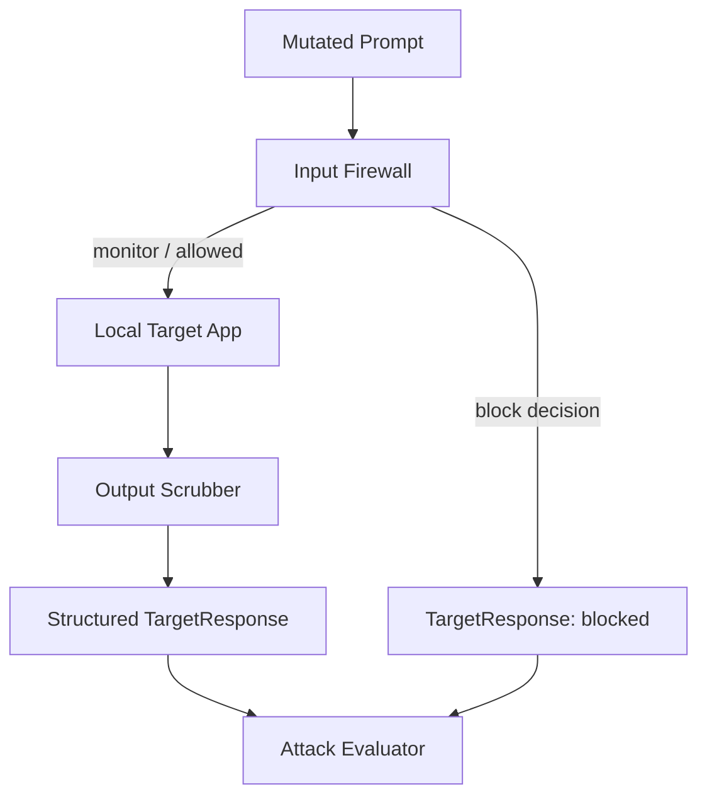
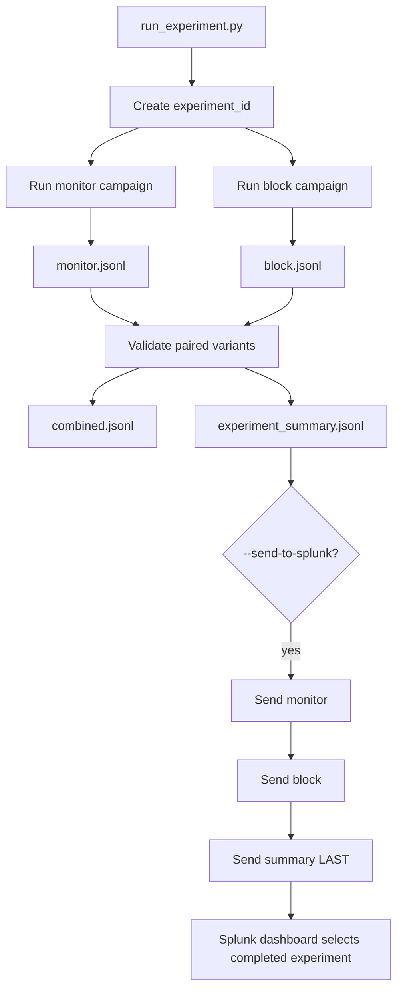

# Prompt-Injection-Simulator

**A reproducible adversarial LLM security benchmarking platform for generating mutated prompt-injection and LLM-abuse payloads, exercising them against a configurable defense pipeline, evaluating attack outcomes independently from defense decisions, producing structured security telemetry, and optionally visualizing the results in Splunk.**

[](https://github.com/calvin-ku/Prompt-Injection-Simulator/actions/workflows/ci.yml)


> [!NOTE]
> **Project status**
>
> The platform currently runs end-to-end against a controlled local target, supports deterministic monitor-versus-block experiments, emits ECS-inspired JSONL telemetry, exports completed experiments to Splunk through HEC, and is covered by an automated Python test suite and GitHub Actions CI. Splunk is an optional downstream analytics layer; the benchmark can be run entirely from the CLI.


**Screenshot here:** Add a dashboard overview showing the key KPIs, attack outcomes, and monitor-vs-block comparison.

## At a glance

| Area | Current implementation |
| --- | --- |
| **Execution** | Python CLI, paired experiment runner, Docker |
| **Adversarial generation** | Seeded deterministic mutation variants from a validated attack catalog |
| **Defense evaluation** | Input firewall → controlled target → output scrubber |
| **Experiment design** | Paired `monitor` vs `block` replay with payload/reproducibility validation |
| **Control traffic** | Benign corpus for false-positive and benign-block measurements |
| **Telemetry** | ECS-inspired JSONL with campaign, experiment, defense, result, and reproducibility fields |
| **Analysis** | CLI benchmark reports; optional Splunk HEC + Dashboard Studio |
| **Quality gates** | 46 passing tests + GitHub Actions CI + Docker smoke validation |

## Why this project matters

Large language model applications create a security problem that is different from traditional request/response software: the same natural-language interface used for legitimate instructions can also be used to manipulate application behavior. Prompt injection, jailbreak attempts, indirect instructions, data-exfiltration prompts, malicious structured payloads, tool-abuse instructions, and resource-exhaustion patterns can all be expressed through text that may look superficially valid.

Manual prompt testing is useful during development, but it does not scale or provide the repeatability needed for meaningful benchmarking. This platform is designed to answer practical questions:

- How does the defense behave across many variations of the same attack?
- Does it merely detect an attack, or actually prevent it?
- Does stronger enforcement increase false positives on benign traffic?
- Can two defense configurations be compared against the exact same payload set?
- Can results be reproduced later from a known seed and analyzed in a SIEM workflow?

The project treats LLM security testing as a repeatable experiment rather than a collection of one-off strings.

## What the platform does

At a high level, the platform can:

- Load and validate canonical attacks plus OWASP and MITRE ATLAS mappings.
- Generate deterministic variants through explicit or seeded-random mutation chains.
- Run adversarial and benign traffic through a local defense pipeline in `monitor` or `block` mode.
- Evaluate attack success independently from detection and blocking decisions.
- Produce ECS-inspired JSONL telemetry and campaign-level benchmark reports.
- Run paired monitor-versus-block experiments, validate matching payload variants, and optionally export completed results to Splunk.

## Architecture

### End-to-end architecture



The platform begins with a validated attack catalog and OWASP/MITRE ATLAS mappings, then uses seeded mutation to create reproducible payload variants. Each payload is sent through the local defense pipeline, evaluated independently for attack success, and recorded as structured JSONL telemetry. That telemetry supports local benchmark reports and optional Splunk dashboards. The flow is intentionally separated so attack generation, defense logic, evaluation, and analytics can be tested or changed without turning the project into one large campaign script.

### Attack engine architecture



Attack engine: Validates the catalog, derives deterministic seeds, generates mutated payload variants, executes them through a target interface, and evaluates the result. Mutators are kept separate from campaign orchestration so transformations stay reusable and independently testable.

### Defense pipeline architecture



Defense pipeline: Routes each prompt through an input firewall, controlled target application, and output scrubber. Separating input and output controls reflects two different security questions: whether a request should reach the target and whether the resulting output is safe to return.

### Paired experiment architecture



run_experiment.py creates one experiment containing two separate campaigns: one in monitor mode and one in block mode. Both runs use the same seed and configuration, then the platform validates that their generated payload variants match before accepting the comparison. This ensures any difference in attack success or prevention is caused by enforcement mode—not by testing different inputs. The completed experiment produces individual campaign files, combined telemetry, and a final summary event that is sent to Splunk last so the dashboard only displays fully uploaded results.

The architecture is intentionally layered. The catalog supplies validated, data-driven attack definitions; the attack engine creates reproducible variants without knowing the firewall's internal logic; and the defense pipeline returns a structured response for independent evaluation. Telemetry is emitted after evaluation, so the same events can power local benchmark reports or Splunk dashboards without coupling the benchmark to a SIEM.

**Screenshot here:** Add a clean architecture or terminal-to-dashboard flow image after the diagrams.

## Quick start

### Prerequisites

```text
Python 3.12+
Git
```

Docker and Splunk are optional.

```bash
git clone https://github.com/calvin-ku/Prompt-Injection-Simulator.git
cd Prompt-Injection-Simulator

python -m venv .venv
source .venv/bin/activate      # Windows PowerShell: .\.venv\Scripts\Activate.ps1
python -m pip install --upgrade pip
pip install -r requirements.txt

python -m pytest -q
```

### Run one campaign

```bash
python run_campaign.py \
  --target local \
  --firewall-mode monitor \
  --target-mode vulnerable \
  --seed 12345 \
  --variants-per-attack 2 \
  --include-benign \
  --output telemetry/quickstart-monitor.jsonl
```

Generate a local benchmark report:

```bash
python -m telemetry.benchmarks \
  --input telemetry/quickstart-monitor.jsonl \
  --json-output telemetry/quickstart-monitor-summary.json \
  --report-output telemetry/quickstart-monitor-report.md
```

### Run the recommended paired experiment

```bash
python run_experiment.py \
  --seed 12345 \
  --variants-per-attack 2 \
  --include-benign
```

The runner executes both firewall modes, validates that their adversarial payload pairs match, and writes artifacts to `telemetry/experiments/<experiment_id>/`.

Useful commands:

```bash
# Inspect every available option
python run_campaign.py --help
python run_experiment.py --help
python -m telemetry.benchmarks --help

# One canonical attack
python run_campaign.py --target local --firewall-mode monitor \
  --target-mode vulnerable --attack ATTACK-INJ-DIR-01 \
  --seed 12345 --variants-per-attack 10 \
  --output telemetry/direct-injection.jsonl

# Force an explicit mutation chain
python run_campaign.py --target local --firewall-mode monitor \
  --target-mode vulnerable --attack ATTACK-INJ-DIR-01 \
  --mutations xml,base64 --seed 12345 --variants-per-attack 1 \
  --output telemetry/explicit-mutation.jsonl

# Benign controls only
python run_campaign.py --target local --firewall-mode monitor \
  --target-mode vulnerable --benign-only \
  --output telemetry/benign-only.jsonl
```

## How to read the results

`attack_succeeded` and `defense_detected` are intentionally separate. A defense can detect an attack but still fail to stop it in monitor mode; a blocked attack can fail even if the target never executes it.

| Outcome | Meaning |
| --- | --- |
| Succeeded + detected | Attack worked, but the defense identified it |
| Succeeded + missed | Highest-risk result: successful undetected attack |
| Failed + detected | Defense or target prevented a detected attack |
| Failed + undetected | Attack did not work, but no detection was recorded |

Benign samples run through the same pipeline so false positives and benign blocking are measurable instead of assumed.

**Benchmark here:** Add a small labeled table from your final reproducible experiment (experiment ID, seed, variants, detection rate, block rate, false-positive rate, and successful-undetected count).

## Docker

```bash
docker build -f infra/Dockerfile -t prompt-injection-simulator .

docker run --rm prompt-injection-simulator --help

mkdir -p docker-output
docker run --rm \
  -v "$(pwd)/docker-output:/app/output" \
  prompt-injection-simulator \
  --target local \
  --firewall-mode monitor \
  --target-mode vulnerable \
  --variants-per-attack 5 \
  --include-benign \
  --output /app/output/events.jsonl

docker run --rm \
  -v "$(pwd)/docker-output:/app/output" \
  --entrypoint python \
  prompt-injection-simulator \
  run_experiment.py \
  --seed 12345 \
  --variants-per-attack 5 \
  --include-benign \
  --output-root /app/output/experiments
```

Mount `/app/output`, not `/app/telemetry`: `telemetry` is an application package and mounting over it hides its source files.

## Optional Splunk workflow

Create `.env.splunk` locally and never commit it:

```dotenv
SPLUNK_PASSWORD=<choose-a-strong-local-admin-password>
SPLUNK_HEC_TOKEN=<choose-a-random-hec-token>
```

```bash
# Start or inspect local Splunk
docker compose --env-file .env.splunk -f infra/docker-compose.splunk.yml up -d
docker ps --filter "name=prompt-injection-splunk"
docker logs --tail 100 prompt-injection-splunk

# After a Codespace restart, prefer restarting the existing container
docker start prompt-injection-splunk

# Run and export a completed paired experiment
python run_experiment.py \
  --seed 12345 \
  --variants-per-attack 100 \
  --include-benign \
  --send-to-splunk \
  --insecure
```

Open Splunk at `http://localhost:8000` (or use the forwarded private port in Codespaces). Do not run `docker compose ... down -v` unless you deliberately want to delete Splunk's persisted data and dashboard state.


<details>
<summary><strong>Building your own custom Splunk dashboard — searches and SPL</strong></summary>

Use a dashboard data source named `Latest Completed Experiment` and reference its experiment token as:

```text
$Latest Completed Experiment:result.experiment_id$
```

Use a `firewall_mode` dropdown with `*`, `monitor`, and `block`. Append the relevant panel search below to this base search.

```spl
index=* source="prompt-injection-simulator"
| spath path=event.type output=event_type
| spath path=experiment_id output=experiment_id
| spath path=target.metadata.firewall_mode output=firewall_mode
| search experiment_id="$Latest Completed Experiment:result.experiment_id$"
```

<details>
<summary><strong>Core KPI searches</strong></summary>

```spl
# Total adversarial tests
| search event_type="adversarial_test" firewall_mode="$firewall_mode$"
| stats count AS "Total Adversarial Tests"
```

```spl
# Attack success rate
| spath path=result.attack_succeeded output=attack_succeeded
| search event_type="adversarial_test" firewall_mode="$firewall_mode$"
| eval succeeded=if(attack_succeeded="true",1,0)
| stats count AS total sum(succeeded) AS successful
| eval "Attack Success Rate (%)"=round((successful/total)*100,2)
| fields "Attack Success Rate (%)"
```

```spl
# Defense detection rate
| spath path=result.defense_detected output=defense_detected
| search event_type="adversarial_test" firewall_mode="$firewall_mode$"
| eval detected=if(defense_detected="true",1,0)
| stats count AS total sum(detected) AS detections
| eval "Detection Rate (%)"=round((detections/total)*100,2)
| fields "Detection Rate (%)"
```

```spl
# False-positive rate
| spath path=result.false_positive output=false_positive
| search event_type="benign_test" firewall_mode="$firewall_mode$"
| eval fp=if(false_positive="true",1,0)
| stats count AS total sum(fp) AS false_positives
| eval "False Positive Rate (%)"=round((false_positives/total)*100,2)
| fields "False Positive Rate (%)"
```

```spl
# Successful undetected attacks
| spath path=result.attack_succeeded output=attack_succeeded
| spath path=result.defense_detected output=defense_detected
| search event_type="adversarial_test" firewall_mode="$firewall_mode$"
| where attack_succeeded="true" AND defense_detected="false"
| stats count AS "Successful Undetected Attacks"
```

</details>

<details>
<summary><strong>Outcome, attack, and threat-mapping searches</strong></summary>

```spl
# Attack / defense outcome matrix
| spath path=result.attack_succeeded output=attack_succeeded
| spath path=result.defense_detected output=defense_detected
| search event_type="adversarial_test" firewall_mode="$firewall_mode$"
| eval outcome=case(attack_succeeded="true" AND defense_detected="true","Succeeded + Detected",attack_succeeded="true" AND defense_detected="false","Succeeded + Missed",attack_succeeded="false" AND defense_detected="true","Failed + Detected",true(),"Failed + Undetected")
| stats count BY outcome
| sort - count
```

```spl
# Success rate by attack
| spath path=attack.id output=attack_id
| spath path=result.attack_succeeded output=attack_succeeded
| search event_type="adversarial_test" firewall_mode="$firewall_mode$"
| eval succeeded=if(attack_succeeded="true",1,0)
| stats count AS tests sum(succeeded) AS successes BY attack_id
| eval success_rate=round((successes/tests)*100,2)
| sort - success_rate
| rename attack_id AS "Attack ID" success_rate AS "Success Rate (%)"
| table "Attack ID" "Success Rate (%)"
```

```spl
# Detection rate by attack
| spath path=attack.id output=attack_id
| spath path=result.defense_detected output=defense_detected
| search event_type="adversarial_test" firewall_mode="$firewall_mode$"
| eval detected=if(defense_detected="true",1,0)
| stats count AS tests sum(detected) AS detections BY attack_id
| eval detection_rate=round((detections/tests)*100,2)
| sort - detection_rate
| rename attack_id AS "Attack ID" detection_rate AS "Detection Rate (%)"
| table "Attack ID" "Detection Rate (%)"
```

```spl
# OWASP distribution
| spath path=owasp.id output=owasp_id
| search event_type="adversarial_test" firewall_mode="$firewall_mode$"
| stats count BY owasp_id
| sort - count
| rename owasp_id AS "OWASP LLM Risk" count AS "Tests"
```

```spl
# MITRE ATLAS distribution
| spath path=mitre_atlas.id output=atlas_id
| search event_type="adversarial_test" firewall_mode="$firewall_mode$"
| stats count BY atlas_id
| sort - count
| rename atlas_id AS "MITRE ATLAS Technique" count AS "Tests"
```

</details>

<details>
<summary><strong>Defense-analysis searches</strong></summary>

```spl
# Top defense detectors
| spath path=defense.detector_names{} output=detector
| search event_type="adversarial_test" firewall_mode="$firewall_mode$"
| mvexpand detector
| stats count BY detector
| sort - count
| rename detector AS "Detector" count AS "Detections"
```

```spl
# Mutation-chain effectiveness
| spath path=mutation.chain{} output=mutation_chain
| spath path=result.attack_succeeded output=attack_succeeded
| spath path=result.defense_detected output=defense_detected
| search event_type="adversarial_test" firewall_mode="$firewall_mode$"
| eval chain=mvjoin(mutation_chain," -> ")
| eval succeeded=if(attack_succeeded="true",1,0) detected=if(defense_detected="true",1,0)
| stats count AS tests sum(succeeded) AS successes sum(detected) AS detections BY chain
| eval success_rate=round((successes/tests)*100,2) detection_rate=round((detections/tests)*100,2)
| sort - success_rate
| rename chain AS "Mutation Chain" success_rate AS "Success Rate (%)" detection_rate AS "Detection Rate (%)"
```

```spl
# Benign false-positive investigation
| spath path=sample.id output=sample_id
| spath path=sample.category output=sample_category
| spath path=result.false_positive output=false_positive
| spath path=result.blocked output=blocked
| spath path=defense.detection_mechanism output=detection_mechanism
| spath path=defense.risk_score output=risk_score
| spath path=features.prompt_entropy output=prompt_entropy
| search event_type="benign_test" false_positive="true" firewall_mode="$firewall_mode$"
| table sample_id sample_category detection_mechanism risk_score prompt_entropy blocked
```

</details>

<details>
<summary><strong>Monitor-versus-block comparison searches</strong></summary>

These panels deliberately do **not** filter on the firewall-mode dropdown. Start with the same base search above, then append one of the following.

```spl
# Attack success rate: monitor vs block
| spath path=result.attack_succeeded output=attack_succeeded
| search event_type="adversarial_test"
| eval succeeded=if(attack_succeeded="true",1,0)
| stats count AS tests sum(succeeded) AS successes BY firewall_mode
| eval success_rate=round((successes/tests)*100,2)
| rename firewall_mode AS "Firewall Mode" success_rate AS "Attack Success Rate (%)"
| table "Firewall Mode" "Attack Success Rate (%)"
```

```spl
# Detection rate: monitor vs block
| spath path=result.defense_detected output=defense_detected
| search event_type="adversarial_test"
| eval detected=if(defense_detected="true",1,0)
| stats count AS tests sum(detected) AS detections BY firewall_mode
| eval detection_rate=round((detections/tests)*100,2)
| rename firewall_mode AS "Firewall Mode" detection_rate AS "Detection Rate (%)"
| table "Firewall Mode" "Detection Rate (%)"
```

```spl
# Block rate by mode
| spath path=result.blocked output=blocked
| search event_type="adversarial_test"
| eval was_blocked=if(blocked="true",1,0)
| stats count AS tests sum(was_blocked) AS blocked_requests BY firewall_mode
| eval block_rate=round((blocked_requests/tests)*100,2)
| rename firewall_mode AS "Firewall Mode" block_rate AS "Block Rate (%)"
| table "Firewall Mode" "Block Rate (%)"
```

```spl
# Benign block rate by mode
| spath path=result.benign_blocked output=benign_blocked
| search event_type="benign_test"
| eval was_blocked=if(benign_blocked="true",1,0)
| stats count AS benign_tests sum(was_blocked) AS benign_blocks BY firewall_mode
| eval benign_block_rate=round((benign_blocks/benign_tests)*100,2)
| rename firewall_mode AS "Firewall Mode" benign_block_rate AS "Benign Block Rate (%)"
| table "Firewall Mode" "Benign Block Rate (%)"
```

```spl
# Paired prevention rate
| spath path=attack.id output=attack_id
| spath path=result.attack_succeeded output=attack_succeeded
| spath path=attack.variant_index output=attack_variant_index
| spath path=reproducibility.variant_index output=repro_variant_index
| spath path=variant_index output=top_variant_index
| eval variant_index=coalesce(attack_variant_index,repro_variant_index,top_variant_index)
| search event_type="adversarial_test"
| eval monitor_success=if(firewall_mode="monitor" AND attack_succeeded="true",1,0) block_success=if(firewall_mode="block" AND attack_succeeded="true",1,0)
| stats max(monitor_success) AS monitor_success max(block_success) AS block_success dc(firewall_mode) AS mode_count BY attack_id variant_index
| where mode_count=2
| eval prevented=if(monitor_success=1 AND block_success=0,1,0)
| stats sum(monitor_success) AS baseline_successes sum(prevented) AS prevented
| eval "Paired Prevention Rate (%)"=round((prevented/baseline_successes)*100,2)
| fields "Paired Prevention Rate (%)"
```

```spl
# Prevention rate by attack
| spath path=attack.id output=attack_id
| spath path=result.attack_succeeded output=attack_succeeded
| spath path=attack.variant_index output=attack_variant_index
| spath path=reproducibility.variant_index output=repro_variant_index
| spath path=variant_index output=top_variant_index
| eval variant_index=coalesce(attack_variant_index,repro_variant_index,top_variant_index)
| search event_type="adversarial_test"
| eval monitor_success=if(firewall_mode="monitor" AND attack_succeeded="true",1,0) block_success=if(firewall_mode="block" AND attack_succeeded="true",1,0)
| stats max(monitor_success) AS monitor_success max(block_success) AS block_success dc(firewall_mode) AS mode_count BY attack_id variant_index
| where mode_count=2
| eval prevented=if(monitor_success=1 AND block_success=0,1,0)
| stats sum(monitor_success) AS baseline_successes sum(prevented) AS prevented BY attack_id
| where baseline_successes>0
| eval prevention_rate=round((prevented/baseline_successes)*100,2)
| sort - prevention_rate
| rename attack_id AS "Attack ID" prevention_rate AS "Prevention Rate (%)"
| table "Attack ID" "Prevention Rate (%)"
```

</details>
</details>

## Quality and scope

```bash
python -m pytest -q
```

The current suite contains 46 passing tests across catalog validation, mutators, reproducibility, defense behavior, benign controls, evaluator outcomes, paired-experiment validation, and Splunk-safe export behavior. GitHub Actions runs these checks automatically.

This project is designed for controlled local targets and security benchmarking. It does not claim to represent every production LLM threat, replace a real application security review, or test third-party systems without authorization.

## Final benchmark: 1000 variations across 8 attack frameworks

```bash
python run_experiment.py \
  --seed 12345 \
  --variants-per-attack 1000 \
  --include-benign \
  --send-to-splunk \
  --insecure
```

### Final Mutation Analysis Summary

The metrics below summarize the **16,000 adversarial executions** from the
paired benchmark. They should not be added together as a population total
because several rows describe overlapping subsets or aggregate statistics.

The experiment generated **8,000 unique adversarial payload variants** and
replayed each variant once in `monitor` mode and once in `block` mode,
resulting in **16,000 adversarial executions**.

For example, an execution can be counted as both a **successful attack** and a
**defense detection**. In the final benchmark, all 1,087 successful executions
were also detected, which is why the success and detection counts overlap.

The 24 benign controls were also replayed in both modes, producing an
additional **48 benign execution events**. Benign events are not included in
the mutation-chain analysis because they are not processed by the adversarial
mutation engine.

| Metric | Result |
| --- | --- |
| Unique adversarial variants | **8,000** |
| Total paired executions | **16,000** |
| Mutation chains observed | **31** |
| Total successes | **1,087** |
| Total detections | **14,234** |
| Highest-success mutation chain | `conversational_noise -> json -> xml` |
| Highest success rate | **39.78%** |
| Largest successful chain population | **1,000 successes** |
| Chains with 100% detection | **20** |
| Lowest observed detection rate | **0.00%** |

#### How the 16,000 adversarial executions break down
| Outcome | Executions |
| --- | ---: |
| Successful + detected | **1,087** |
| Successful + undetected | **0** |
| Failed + detected | **13,147** |
| Failed + undetected | **1,766** |
| **Total adversarial executions** | **16,000** |


### Mutation-Chain Effectiveness Across Paired Executions

The final experiment generated 8,000 unique adversarial payload variants. Each
variant was replayed once in monitor mode and once in block mode, resulting in
16,000 total adversarial execution events.

**Benchmark here:** After the run, add a concise results table and the final dashboard screenshot. Keep the experiment ID, seed, variant count, attack success rate, detection rate, block rate, false-positive rate, benign-block rate, successful-undetected attacks, and paired prevention rate.
